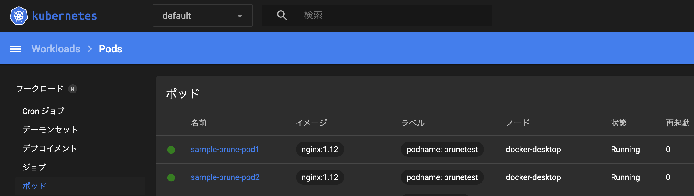
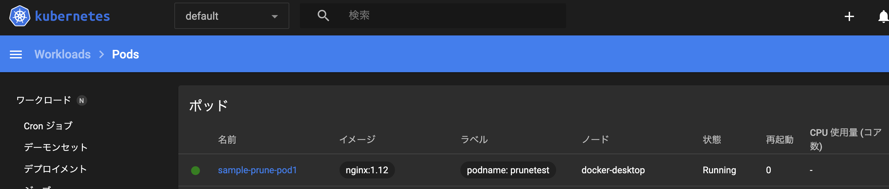

# Pruneによるリソース削除
## kubectlコマンドについて
k8sの運用として、kubectlコマンドはほとんど利用しないとのこと。   
理由としてはヒューマンエラーが発生しやすいことに加え、管理可能なリソースの数に上限があることため。   
解決策としてはマニフェストファイルをGitリポジトリ上で管理して、変更があった際にkubectl applyで自動的にマニフェストを適用する方法が挙げられる。   

ただし、この方法にも欠点が。   
マニフェストから記述を削除されたリソースを検知する仕組みを作らなければならない。   
この時にkubectl apply --pruneを実行することでマニフェストから削除されたリソースを検知して、自動的にリソースを削除する。  

CI/CDパイプラインに実装する際には「--prune」オプションを指定し続ける形で実装すれば良い。   
--pruneの活用例を確かめるために、以下のマニフェストファイルをサンプルに実行してみる。   

## マニフェストファイル1（sample-1.yaml）

```yaml:
apiVersion: v1
kind: Pod
metadata:
  name: sample-prune-pod1
  labels:
    podname: prunetest
spec:
  containers:
    - name: nginx-container
      image: nginx:1.12
```

## マニフェストファイル1（sample-2.yaml）

```yaml:
apiVersion: v1
kind: Pod
metadata:
  name: sample-prune-pod2
  labels:
    podname: prunetest
spec:
  containers:
    - name: nginx-container
      image: nginx:1.12
```

そして、以下のコマンドでこのマニフェストを適用する。   

```bash:
kubectl apply -f ./prune-sample/
```

このコマンドの実行結果は以下のようになり、Podが二つ登録される。


フォルダからマニフェストを1つ(sample-2.yaml)削除して、再度同じコマンドを実行してみる。   

```bash:
kubectl apply -f ./prune-sample/
```

結果は以下のようになり、リソースが削除されたことを反映することができない。   

```bash:
pod/sample-prune-pod1 unchanged
```

一方、--pruneオプションを指定して実行すると。

```bash:
kubectl apply -f ./prune-sample/ --prune -l podname=prunetest
```

結果は以下の通りとなり、リソース削除を適用できる。   

```bash:
pod/sample-prune-pod1 unchanged
pod/sample-prune-pod2 pruned
```



こちらのpruneはマニフェストファイルが1つであっても、リソースを削除した場合にも削除を反映できる優れものとのこと。   

このpruneの動作としてはラベルに一致する全リソースのリストから、kubectl applyコマンドに渡したマニフェストにないもの全てを削除するという仕組みになっているため、pruneを指定する際にはラベルを指定する必要があるとのこと。   

このpruneには--allオプションがあるが、これを利用するためにはクラスタにデプロイされているリソースの全てのマニフェストファイルを読み込ませないと全てのリソースを削除することになり、非常に危険な操作となるため注意が必要。   

以下のコマンドは禁断のコマンド。

```bash:
kubectl apply -f ./ --prune --all
```

このコマンドの注意事項として、ディレクトリごとにシステムを分けて構成している場合。   
ラベルを同一のものにして、ディレクトリを分け、ラベル込みでどちらか一方のディレクトリを指定して、pruneを実行してしまうと、どちらか一方のリソースが消えてしまうことになるという点。（なんか普通にそういうことありそう…）
