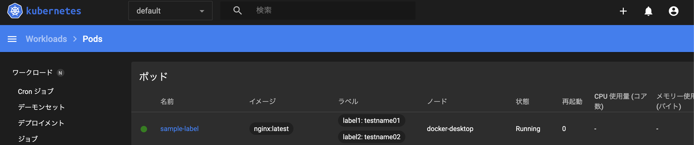
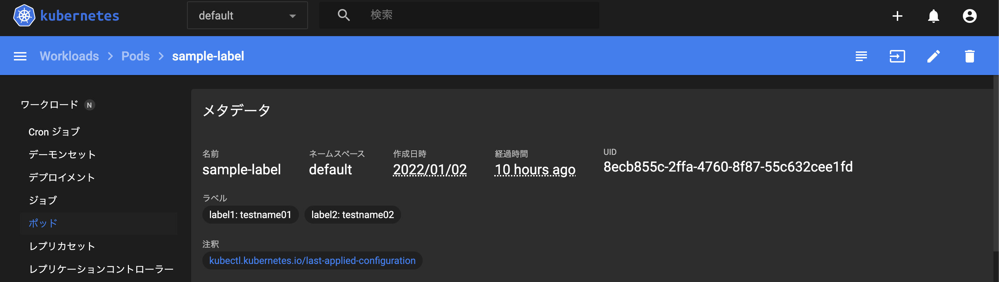
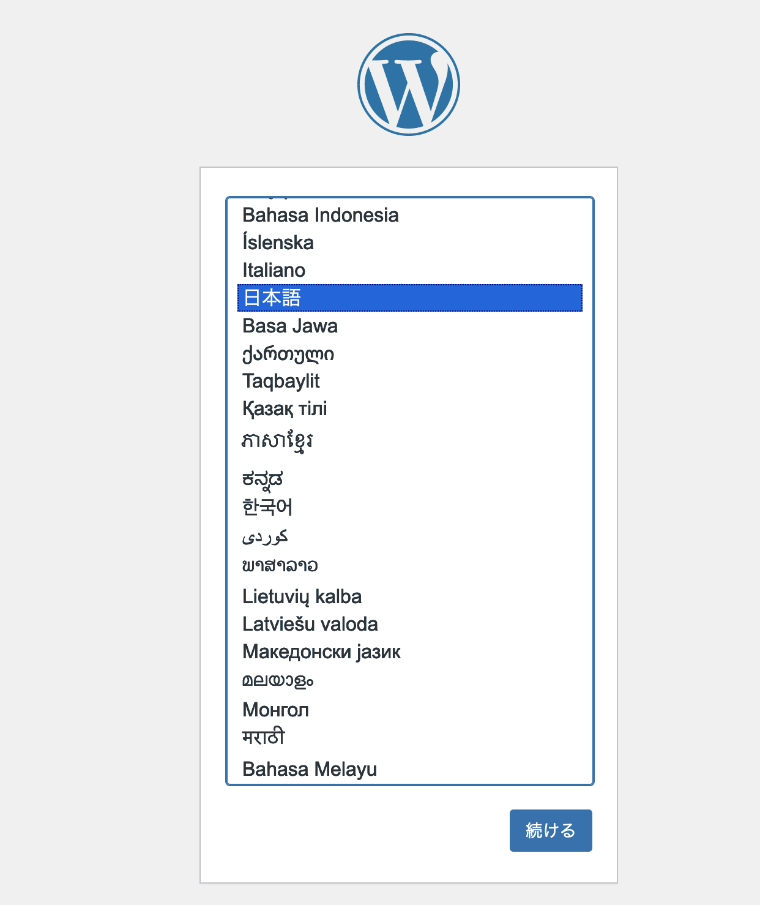
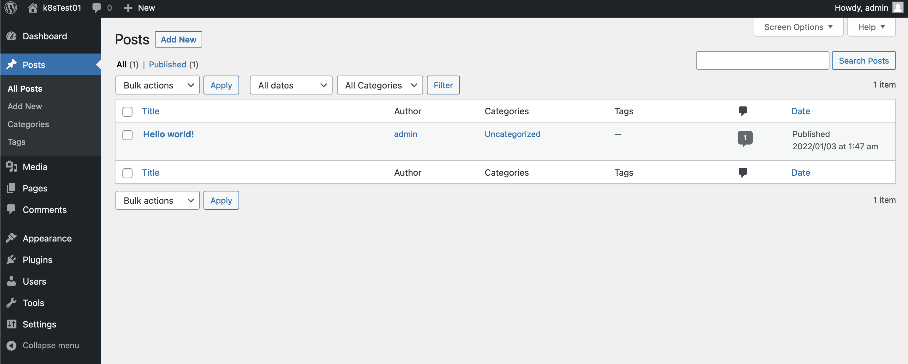
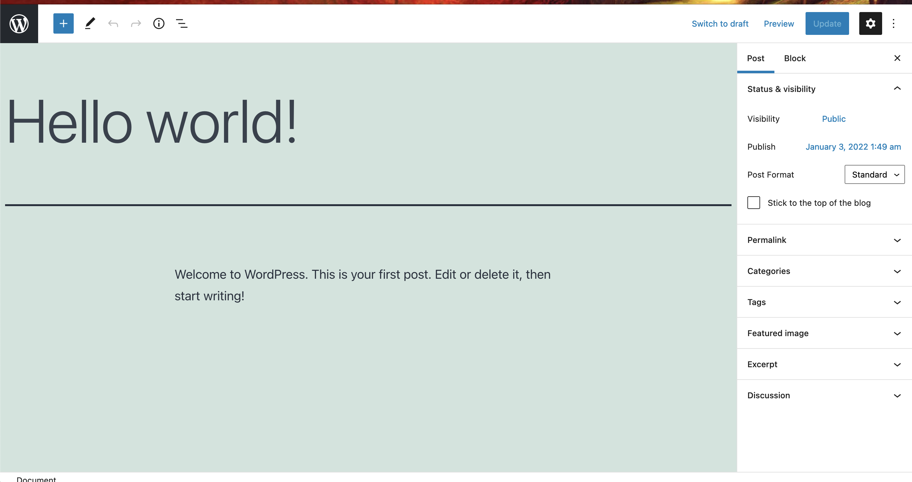

# アノテーションについて
一般的にプログラミングとかでは注釈的な位置付けでメタデータとして扱われる。   
k8sの場合、主に以下の用途として、扱われるとのこと。   

1.システムコンポーネントのための情報を保存する。   
2.全ての環境では利用できない設定を行う。   
3.正式に組み込まれる前の機能の設定を行う。   

## システムコンポーネントのための情報保存

アノテーション自体はダッシュボード上で「注釈」という欄に表示されている。


この中の以下の項目がシステムコンポーネントの情報が保存されているとのこと。   
"kubectl.kubernetes.io/last-applied-configuration"

実際にこちらのアノテーションに触れてみると、以下のように情報が格納されていた。


```json:
{
	"apiVersion": "v1",
	"kind": "Pod",
	"metadata": {
		"annotations": {
			"annotations": "nametest02"
		},
		"name": "sample-annotations",
		"namespace": "default"
	},
	"spec": {
		"containers": [
			{
				"image": "nginx:1.21.5",
				"name": "nginx-container"
			}
		]
	}
}
```

これらのアノテーションはユーザーが付与するものではなく、システムが自動的に付与するものであるということらしい。   
アノテーションを意図的に付与していないものであっても、以下のコマンドを実行することでシステム的に付与される情報があるとのことです。   

```bash:
kubectl get deployment -o yaml order1-deployment
```

結果として以下が得られる。   
結局、以下の情報はユーザーが設定するものではないので気にしなくて良い。

```bash:
apiVersion: apps/v1
kind: Deployment
metadata:
  annotations:
    deployment.kubernetes.io/revision: "1"
    kubectl.kubernetes.io/last-applied-configuration: |
      {"apiVersion":"apps/v1","kind":"Deployment","metadata":{"annotations":{},"name":"order1-deployment","namespace":"default"},"spec":{"replicas":4,"selector":{"matchLabels":{"app":"sample-app"}},"template":{"metadata":{"labels":{"app":"sample-app"}},"spec":{"containers":[{"image":"nginx:1.12","name":"nginx-container","ports":[{"containerPort":80}]}]}}}}
  creationTimestamp: "2022-01-02T12:46:34Z"
  generation: 1
  name: order1-deployment
  namespace: default
  resourceVersion: "82851"
  uid: 07ca7e5a-6f26-4563-adc2-ea594a90a2c8
spec:
  progressDeadlineSeconds: 600
  replicas: 4
  revisionHistoryLimit: 10
  selector:
    matchLabels:
      app: sample-app
  strategy:
    rollingUpdate:
      maxSurge: 25%
      maxUnavailable: 25%
    type: RollingUpdate
  template:
    metadata:
      creationTimestamp: null
      labels:
        app: sample-app
    spec:
      containers:
      - image: nginx:1.12
        imagePullPolicy: IfNotPresent
        name: nginx-container
        ports:
        - containerPort: 80
          protocol: TCP
        resources: {}
        terminationMessagePath: /dev/termination-log
        terminationMessagePolicy: File
      dnsPolicy: ClusterFirst
      restartPolicy: Always
      schedulerName: default-scheduler
      securityContext: {}
      terminationGracePeriodSeconds: 30
status:
  availableReplicas: 4
  conditions:
  - lastTransitionTime: "2022-01-02T12:46:40Z"
    lastUpdateTime: "2022-01-02T12:46:40Z"
    message: Deployment has minimum availability.
    reason: MinimumReplicasAvailable
    status: "True"
    type: Available
  - lastTransitionTime: "2022-01-02T12:46:34Z"
    lastUpdateTime: "2022-01-02T12:46:40Z"
    message: ReplicaSet "order1-deployment-68bfbcc7b9" has successfully progressed.
    reason: NewReplicaSetAvailable
    status: "True"
    type: Progressing
  observedGeneration: 1
  readyReplicas: 4
  replicas: 4
  updatedReplicas: 4
```

## 2.全ての環境では利用できない設定を行う

これはGKE、AKS、EKSなどでそれぞれ独自の設定を格納するために利用されるとのこと。   
例えば、GKEとEKSではローカルIPアドレスを持ったインターナルなエンドポイントの作成が可能。   
GKEの場合、「cloud,google.com/load-balancer-type: "Internal"」   
EKSの場合、「service.beta.kubernetes.io/aws-load-balancer-internal:0.0.0.0/0」   
上記のような感じで環境特有のアノテーションというものがあるようだ。   

## 3.正式に組み込まれる前の機能設定

最近は見かけなくなったがベータ版の機能、正式実装される前の機能を設定する際に利用することがあったとのこと。   
以前はStorageClassやInit Containerなどの機能はアノテーションを利用して実装する必要があったとのこと。   
いずれにしても、アノテーションの機能はあまり利用する頻度は少ないという認識で問題なさそうだ。   

# ラベル

アノテーションに比べると圧倒的にこちらのほうが利用頻度が高そうな予感がしている。   
以下のコマンドを実行して、Podに対して、ラベルを付与する。   

```yaml:
apiVersion: v1
kind: Pod
metadata:
  name: sample-label
  labels:
    label1: testname01
    label2: testname02
spec:
  containers:
   - name: nginx-container
     image: nginx:latest
```
こちらのマニフェストファイルは1つのPodに対して、「testname01」という値のラベル1属性を一つ付与。   
「testname02」という値のラベル2属性を一つ付与している。   

上記のPodを作成後、以下のコマンドを実行してPodが作成されていることを確認してみる。   




上記のように1つのPodに対して、2つのラベルが付与されていることが分かる。   
こちらはコマンドを実行して、フィルターを掛けることでも、情報を分別して表示することが可能になる。   

```bash:
get pods -l label1=testname01
```

こちらの実行結果が以下となる。

```bash:
NAME           READY   STATUS    RESTARTS   AGE
sample-label   1/1     Running   0          10h
```

対してフィルターをかけない場合の結果が以下の通り。   

```bash:
NAME                                 READY   STATUS    RESTARTS   AGE
order1-deployment-68bfbcc7b9-tpxwr   1/1     Running   0          11h
order1-deployment-68bfbcc7b9-w9qnm   1/1     Running   0          11h
order1-deployment-68bfbcc7b9-wnwq2   1/1     Running   0          11h
order1-deployment-68bfbcc7b9-zwcn5   1/1     Running   0          11h
sample-annotations                   1/1     Running   0          11h
sample-label                         1/1     Running   0          10h
```

また、どのPodにどのラベルが付与されているかをコマンドで確認可能。   

```bash:
kubectl get pods -l label1=testname01 -L label1,label2
```

上記の-Lオプションでラベル名を指定して、画面に表示することが可能になる。   

```bash:
NAME           READY   STATUS    RESTARTS   AGE   LABEL1       LABEL2
sample-label   1/1     Running   0          11h   testname01   testname02
```

## 複数のPodに複数のラベルを設定してデプロイする

以下のマニフェストファイルを用意して、複数のPodに対して、複数の異なるラベルを付与し、デプロイしてみる。   
以下はMySQLとWordPressのPodを分けて、デプロイするためのマニフェストファイルをそれぞれ用意してみる。

### MySQLのマニフェスト

```yaml:
apiVersion: apps/v1
kind: Deployment
metadata:
  name: multi-pods01
spec:
  replicas: 2
  selector:
    matchLabels:
      label1: mysql-01
  template:
    metadata:
      labels:
        label1: mysql-01
    spec:
      containers:
       - name: mysql-container
         image: mysql:5.7
         ports:
          - containerPort: 3306
         env:
          - name: MYSQL_ROOT_PASSWORD
            value: P@ssw0rd
          - name: MYSQL_DATABASE
            value: wordpress
          - name: MYSQL_USER
            value: wordpress
          - name: MYSQL_PASSWORD
            value: wordpress
---
apiVersion: v1
kind: Service
metadata:
  name: mysqlservice01
  label1: mysql-01
spec:
  type: ClusterIP
  ports:
   - port: 3306
  selector:
    label1: mysql-01
```

### WordPressのマニフェスト
```yaml:
apiVersion: apps/v1
kind: Deployment
metadata:
  name: multi-pods02
spec:
  replicas: 2
  selector:
    matchLabels:
      label1: wordpress-01
  template:
    metadata:
      labels:
        label1: wordpress-01
    spec:
      containers:
      - name: wordpress-container
        image: wordpress:latest
        ports:
         - containerPort: 80
           name: wordpress
        env:
         - name: WORDPRESS_DB_HOST
           value: mysqlservice01:3306
         - name: WORDPRESS_DB_PASSWORD
           value: P@ssw0rd
         - name: WORDPRESS_DB_USER
           value: root
         - name: WORDPRESS_DB_NAME
           value: wordpress
---
apiVersion: v1
kind: Service
metadata:
  name: wordpress
  labels:
    label1: wordpress-01
spec:
  type: LoadBalancer
  ports:
   - port: 80
  selector:
    label1: wordpress-01
```
ひとまず、以下のようにインストールが完了する。



