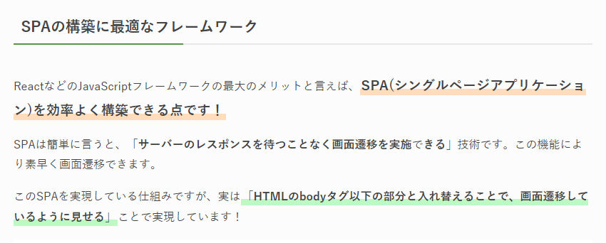
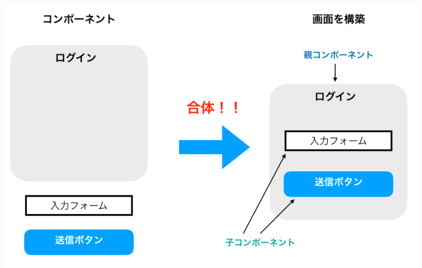
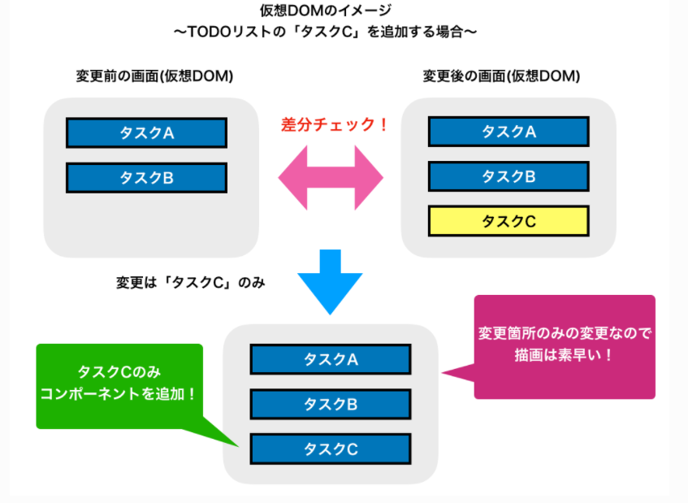
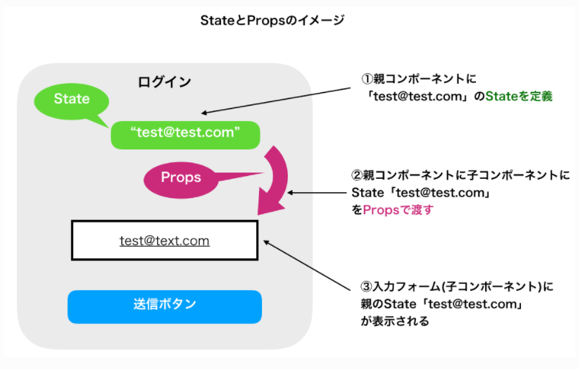

# Reactの理解
Reactは何ができるのか？   

  

・SPAを効率よく作れる   
　→ URLが変わると動的にHTMLの要素部分を変更する。   
　　 これを理解するにはコンポーネントを理解する必要がある。

# コンポーネント
・ポイント１：ReactはJSの中でHTMLを書き、ボタン、ヘッダー、フッダーなどの画面の部品単位でパーツを作ることが可能。   
　→ 上記、部品のこのを「コンポーネント」と呼んで、コンポーネントを組み合わせることで画面を構築できる。   
　SPAの画面遷移はコンポーネントを入れ替えることで実現しており、JSの中でHTMLを記載する方法を「JSX」と呼び、この方法でコンポーネントファイルを作成する。   
  

・ポイント2：導入される側は「親コンポーネント」、導入する側は「子コンポーネント」と呼ぶ。   
　→ コンポーネントはJSファイルとして作成し、親コンポーネントのJSファイルに子コンポーネントとしてJSファイルをインポートする。   
　　この構成を実現するためには「ECMAモジュール」を使用する。

# 更新したデータの箇所だけを更新する(仮想DOM)
Reactのメリットの1つ。「更新されたデータに影響のある箇所だけ変更される」点について。   

___☆Reactを用いていない場合：___   
　・一部分だけでの変更を実施する場合でも画面全体を再描画しなければならない。   
　・同期通信が走り、再描画に時間がかかり、操作性が悪い。   
　・仮にajaxを利用して非同期通信もできるが、保守性の悪い複雑なコードになりがち。

___☆Reactを用いた場合：___
　・更新されたデータに関連する画面パーツのみを再描画させることが出来る。
　・かつ、シンプルなコードを保てる。

  

# コンポーネントに状態を持つ(StateとProps)
「UIが変わった」という判断をどこに持たせるのか？   

・コンポーネントごとに「状態」を「State」として持たすことができる。   
・「useState」の機能で状態を持たすことができる。   
・「Props」により、コンポーネントの状態を入れ子にして親から子へ定義した状態を引き渡すことができる。   
  

# Reactの基礎は状態管理！
Reactは「State」や「Props」を用いた状態管理を実施することで快適なUIを維持している。   

・コンポーネント内での状態の受け渡し方法は「Props」の他に「ContextAPI」という機能がある。   
・親子関係の関係ないコンポーネントに共通の状態を用いたい場合には「Redux」がある。   
※こちらはコンポーネント外で状態管理を実施する機能であり、それらを「グローバルステート」、「ストア」と呼んだりする。   

__結論：Reactでの状態管理は超重要__